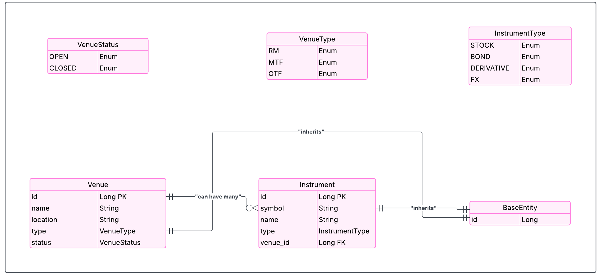

# TradeVenue API

A RESTful API for managing trading venues and financial instruments. Users can create, read, update, and delete venue and instrument records. Built with **Java 21** and **Spring Boot**, this project demonstrates core API development skills including CRUD operations, database integration, filtering, unit testing, and exception handling.

---

## Features

- Manage venues: create, read, update, delete, open/close
- Manage instruments: create, read, update, delete, filter by venue
- Filter venues by status or name
- Full CRUD operations for both entities
- Unit tests for services
- Exception handling with meaningful responses
- MySQL database integration

---

## Entities

### Venue
- **ID**: Unique identifier
- **Name**: Venue name
- **Location**: Physical or jurisdiction location
- **Type**: RM (Regulated Market), MTF (Multilateral Trading Facility), OTF (Organized Trading Facility)
- **Status**: OPEN, CLOSED

### Instrument
- **ID**: Unique identifier
- **Symbol**: Instrument ticker symbol
- **Name**: Instrument name
- **Venue**: Associated venue (foreign key)
- **Type**: STOCK, BOND, DERIVATIVE, FX

---

## API Endpoints

### Venues
| Method | Endpoint | Description |
|--------|---------|-------------|
| GET | `/api/venues` | List all venues |
| GET | `/api/venues/{id}` | Get a specific venue |
| POST | `/api/venues` | Create a new venue |
| PUT | `/api/venues/{id}` | Update venue details |
| DELETE | `/api/venues/{id}` | Delete a venue |

### Instruments
| Method | Endpoint | Description |
|--------|---------|-------------|
| GET | `/api/instruments` | List all instruments |
| GET | `/api/instruments/{id}` | Get a specific instrument |
| GET | `/api/instruments/venue/{venueId}` | List instruments by venue |
| POST | `/api/instruments` | Create a new instrument |
| PUT | `/api/instruments/{id}` | Update an instrument |
| DELETE | `/api/instruments/{id}` | Delete an instrument |

---

### Entity Relationship Diagram (ERD)
The following diagram illustrates the relationships between the core entities in the database.



---

## Tech Stack

- Java 21
- Spring Boot
- Spring Data JPA
- MySQL (for production)
- Maven
- JUnit 5 (unit testing)
- Git & GitHub

---

## Getting Started

### Clone the Repository

```bash
git clone https://github.com/Tobijimoh/venue-management-api.git
cd venue-management-api
```

---

## Database Setup

This project uses **MySQL** for data storage.

1. **Create and use the database:**

```sql
CREATE DATABASE IF NOT EXISTS venue_db;
USE venue_db;
```

2. **Import the database dump file:**

```bash
mysql -u [username] -p < db/venue_db_dump.sql
```
The database dump file is named `venue_db_dump.sql` and is located in the `db` folder at the project root.

---

## Running the Application

1. **Build and run the application:**

```bash
mvn clean install
mvn spring-boot:run
```

2. **Access the API:**  
[http://localhost:8080/api](http://localhost:8080/api)


3. **API Documentation (Swagger):**  
[http://localhost:8080/swagger-ui.html](http://localhost:8080/swagger-ui.html)

---

## Running Tests

Unit tests are included for **VenueService** and **InstrumentService** to validate core business logic.  
Run all tests with:

```bash
mvn test
```